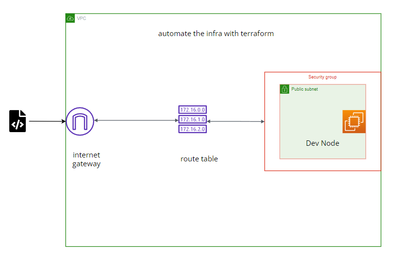

# Demo Infrastructure

This repository contains Terraform configurations to set up a simple AWS infrastructure, including a VPC, subnet, internet gateway, route table, security group, key pair, and an EC2 instance.



## Components

- **VPC**: A virtual private cloud to isolate resources.
- **Subnet**: A public subnet within the VPC.
- **Internet Gateway**: Enables internet access for resources within the VPC.
- **Route Table**: Routes traffic to the internet.
- **Security Group**: Manages inbound and outbound traffic for the EC2 instance.
- **Key Pair**: Used for SSH access to the EC2 instance.
- **EC2 Instance**: A t2.micro instance running Ubuntu.

## Prerequisites

- [Terraform](https://www.terraform.io/downloads.html) installed.
- AWS account with appropriate permissions.
- AWS CLI configured with your credentials.

## Usage

1. **Clone the repository:**
   ```sh
   git clone https://github.com/yourusername/demo-infra.git
   cd demo-infra
Initialize Terraform:
```sh
   terraform init


Validate the configuration:
```sh
terraform validate
Plan the infrastructure changes:

```sh
terraform plan
Apply the configuration:

```sh
terraform apply
Confirm the apply action by typing yes when prompted.

Cleaning Up
To destroy the created infrastructure, run:
```sh
terraform destroy